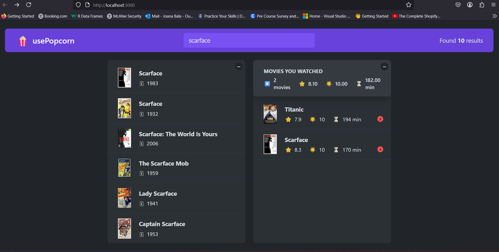

# UsePopcorns 🎜🍿

**UsePopcorns** is a **React-based movie rating app** where you can browse, rate, and track movies you’ve watched. 🎥✨

While this app isn’t **biotech-related** (yet 👀), I decided to start with something **fun and universal—movies!** 🍿 Because, let’s face it, whether you’re decoding DNA or debugging JavaScript, we all need a little **Scarface** or **Titanic** moment now and then.

But hey, I’m **crossing my fingers 🤞** that my **next project** will mix **biotech and software development** (think **genes meet JavaScript** 🧬💻). For now, this project helps me **build my frontend skills** and collect as much **feedback** as possible—**so don’t hold back!**

**Learning in public** is scary, but it’s the best way to grow. So here I am, sharing this **work-in-progress**, every line of code representing a step toward **professionalism** (and maybe, world domination... kidding! 😅).

Feel free to **explore**, **break things**, or **drop feedback**. I **welcome collaboration**, **ideas**, or even **movie recommendations** (because popcorn without movies is just sad 💔).

---

## 🛠️ Technologies Used

- **React 18** (Functional Components + Hooks)
- **JavaScript (ES6+)**
- **Custom Hooks** (`useMovies.js`, `useKey.js`)
- **CSS Modules** & **PostCSS** (modular styling)
- **Webpack** (bundling)
- **Node.js & npm** (dependency management)

---

## 🚀 Getting Started

These steps will help you **set up and run the project locally**.

---

### **Prerequisites**

Make sure you have:

- **Node.js** (v16+): [Download from nodejs.org](https://nodejs.org/)
- **npm** (comes with Node.js)
- **Git**: [Download from git-scm.com](https://git-scm.com/)

Check versions with:

```bash
node -v
npm -v
git --version
```

---

### **Setup Instructions**

1. **Clone the repository:**

```bash
git clone https://github.com/Misko22/usepopcorns.git
cd usepopcorns
```

2. **Install dependencies:**

```bash
npm install
```

3. **Start the development server:**

```bash
npm start
```

4. **Open your browser at:**

```
http://localhost:3000
```

Enjoy **UsePopcorns** in action! 🍿

---

## 📸 Screenshots

Here’s a sneak peek of the app in action:  
_Searching for "Scarface" and managing the watchlist._



---

## 🗓️ Roadmap / Future Enhancements

- Integrate a **movie database API** (e.g., TMDb, OMDb)
- Enhance **mobile responsiveness** for all devices
- Add **user authentication** for personalized experiences
- Improve **error handling** and **loading states**
- And maybe… just maybe… a **biotech dashboard** in the next project 🧬😉

---

## 🙌 Acknowledgements

Special thanks to:

- **Coffee ☕️**
- **YouTube tutorials 🎥**
- **Stack Overflow** (our unofficial co-pilot)
- And my **biotech roots** for teaching me patience (because DNA sequencing takes longer than waiting for `npm install`! 😅)

This project is part of my **journey blending biotechnology and software development**. Currently, I’m studying **Computer Programming** at **Seneca Polytechnic (Toronto, Canada)** and bridging **science with code** one project at a time!

---

